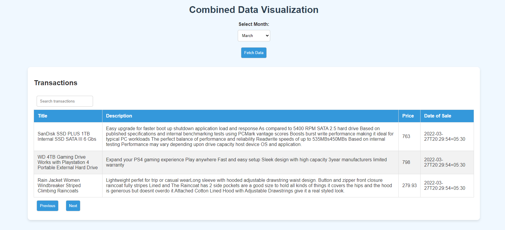
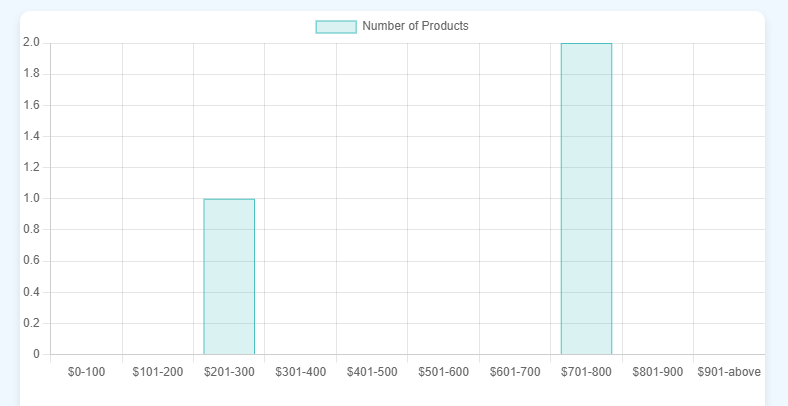
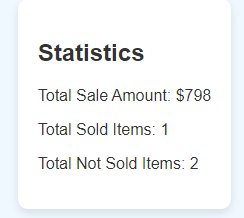

# NodeJS Assignment

This project sets up a Node.js server that connects to a MongoDB database, fetches product transaction data from an external source, and provides multiple APIs to retrieve and analyze the stored products.

## How to Run

Run all the js files using `node filename.js` and then open the `FinalIndex.html` file to get the desired output.

## Table of Contents

- [API Endpoints](#api-endpoints)
  - [Initialize Database](#initialize-database)
  - [Get Statistics](#get-statistics)
  - [Get Transactions](#get-transactions)
  - [Get Bar Chart Data](#get-bar-chart-data)
  - [Get Pie Chart Data](#get-pie-chart-data)
  - [Get Combined Data](#get-combined-data)
- [Database Schema](#database-schema)
- [Final Output](#final-output)

## API Endpoints

### Initialize Database

**Endpoint:** `GET /initialize-db`

**Description:** Fetches JSON data from a third-party API and initializes the database with seed data.

**Steps:**

1. Set up a Node.js project with Express.js.
2. Install necessary packages: `axios` for making HTTP requests and `mongoose` for interacting with the database.
3. Define a route for the initialization API (`/initialize-db`) and a function to handle the request.
4. In the function, make a GET request to the third-party API using `axios` to fetch the JSON data.
5. Parse the JSON data and create a new collection/table in your database (`products`) using `mongoose`.
6. Insert each product as a new document into the `products` collection/table.
7. Send a response to the client indicating the success or failure of the database initialization.

### Get Statistics

**Endpoint:** `GET http://localhost:2005/statistics?month=:month`

**Description:** Fetches statistics for the selected month, including total sale amount, total number of sold items, and total number of not sold items.

**Parameters:**

- `month` (string): The month for which to fetch the statistics (e.g., "March").

**Response:**

{
"totalSaleAmount": 12345.67,
"totalSoldItems": 100,
"totalNotSoldItems": 50
}

### Get Transactions

**Endpoint:** 'GET http://127.0.0.1:2006/products'

Description: Fetches all product transactions stored in the database.

Response:

```json
{
"productId": "123",
"productName": "Product A",
"transactionDate": "2023-10-01",
"amount": 100.00,
"status": "sold"
},
{
"productId": "124",
"productName": "Product B",
"transactionDate": "2023-10-02",
"amount": 150.00,
"status": "not sold"
}
```

### Get Bar Chart Data

**Endpoint:** 'GET http://127.0.0.1:4000/bar-chart'

Description: Fetches data to be used for generating a bar chart.

Response:

```json
{
  "labels": ["January", "February", "March"],
  "data": [1000, 1500, 2000]
}
```

### Get Pie Chart Data

**Endpoint:** GET http://127.0.0.1:5000/pie-chart

Description: Fetches data to be used for generating a pie chart.

### Response:

```json
{
  "labels": ["Sold", "Not Sold"],
  "data": [70, 30]
}
```

### Get Combined Data

**Endpoint:** GET http://localhost:3000/combined-data/:month

Description: Fetches combined data for various analyses.

### Response:

```json
{
  "statistics": {
    "totalSaleAmount": 12345.67,
    "totalSoldItems": 100,
    "totalNotSoldItems": 50
  },
  "barChart": {
    "labels": ["January", "February", "March"],
    "data": [1000, 1500, 2000]
  },
  "pieChart": {
    "labels": ["Sold", "Not Sold"],
    "data": [70, 30]
  },
  "transactions": [
    {
      "productId": "123",
      "productName": "Product A",
      "transactionDate": "2023-10-01",
      "amount": 100.0,
      "status": "sold"
    },
    {
      "productId": "124",
      "productName": "Product B",
      "transactionDate": "2023-10-02",
      "amount": 150.0,
      "status": "not sold"
    }
  ]
}
```

## Database Schema

Define the schema for the products collection/table using Mongoose:

```javascript
const mongoose = require("mongoose");

const productSchema = new mongoose.Schema({
  id: { type: Number, required: true },
  title: { type: String, required: true },
  price: { type: Number, required: true },
  description: { type: String, required: true },
  category: { type: String, required: true },
  image: { type: String, required: true },
  sold: { type: Boolean, default: false },
  dateOfSale: { type: Date },
});

const Product = mongoose.model("Product", productSchema);

module.exports = Product;
```

### Final Output

Here are some images of the final output:

## Transaction List



## BarGraph



## Pie Chart


## Statistics Data


